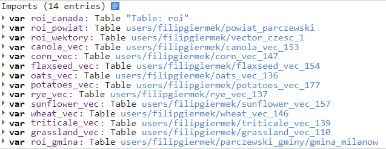

<h1 align="center"> SUPERVISED CROPLAND CLASSIFICATION BASED ON SENTINEL-1 SAR IMAGES IN POLAND </h1>

<table>
  <tr>
      <td>
    <td> Engineering Thesis written by Filip Giermek, geoinformatics at </br>Geology, Geophysics and Enviromental Protection Faculty at University of Science and Technology in Cracow. </td>
  </tr>
</table> 

## Scope of the project
This paper focuses on conveying supervised random forest algorithm-based crop types recognition analysis in
chosen region of Poland, with usage of free software and open-access data. The goal of this paper is to recreate
general methodology of such projects and test usage of SAR imagery as a base. Area of interest is one of municipal
regions in eastern Poland.

## Ready-Data
Main reference was scientific paper titled
<h3> <strong><em>Sentinel-1 sar backscatter analysis ready data preparation in google earth engine</strong></em> </h3>
links: [GitHub](https://www.mdpi.com/2072-4292/13/10/1954); [paper](https://www.mdpi.com/2072-4292/13/10/1954)
authors: Mullissa, A.; Vollrath, A.; Odongo-Braun, C.; Slagter, B.; Balling, J.; Gou, Y.; Gorelick, N.; Reiche, J. </br></br>

<p> This paper provides JS script, which produces pre-processed SAR images in ready-data mode. It is possible to set suitable parameters regarding each step of pre-procession. As it is stated in the paper: <em> "This framework is intended for researchers and non-experts in microwave remote sensing. It is intended to provide flexibility for a wide variety of large area land and inland water monitoring applications." </em> </p>

## Technicalities
Script is written in JavaScript in Google Earth Engine. Pre-processing of raster and vector data was done in QGIS. Final map layouts were prepared in ArcGIS Pro.

## Objects
- try-out GEE as a tool for cloud-based satellite imagery analysis
- testing usability of SAR imagery as basemap for such a project
- an attempt to convey a research similar to more advanced ones in the same field
- convey analysis of crop-type structure in area of interest

## Workflow


## Product


## Code Snippets
- setting of pre-processing parameters
```js
var parameter_func = function (geometry) {
  var parameter = { 
              //1. Data Selection
              START_DATE: "2021-06-1",
              STOP_DATE: "2021-06-30",
              POLARIZATION:'VVVH',
              ORBIT : 'BOTH',
              GEOMETRY: geometry,
              //2. Additional Border noise correction
              APPLY_ADDITIONAL_BORDER_NOISE_CORRECTION: true,
              //3.Speckle filter
              APPLY_SPECKLE_FILTERING: true,
              SPECKLE_FILTER_FRAMEWORK: 'MULTI',
              SPECKLE_FILTER: 'BOXCAR',
              SPECKLE_FILTER_KERNEL_SIZE: 15,
              SPECKLE_FILTER_NR_OF_IMAGES: 10,
              //4. Radiometric terrain normalization
              APPLY_TERRAIN_FLATTENING: true,
              DEM: ee.Image('USGS/SRTMGL1_003'),
              TERRAIN_FLATTENING_MODEL: 'VOLUME',
              TERRAIN_FLATTENING_ADDITIONAL_LAYOVER_SHADOW_BUFFER: 0,
              //5. Output
              FORMAT : 'DB',
              CLIP_TO_ROI: true,
              SAVE_ASSETS: false
  }
return parameter;
}
````

- an example of sample points creator
```js
var oats_points = ee.FeatureCollection.randomPoints(
    {region: oats_vec, points: NOP, seed: 0, maxError: 1})
    .map(function(f) {
        return f.set('landcover', 0)
    });
````

- applying pre-processing functions to imported images
```js
 var s1_preprocces1_view = s1_preprocces1.map(helper.add_ratio_lin).map(helper.lin_to_db2);
    var s1_1_view = s1_1.map(helper.add_ratio_lin).map(helper.lin_to_db2);
    visparam = {bands:['VV','VH','VVVH_ratio'],min: [-20, -25, 1],max: [0, -5, 15]}
````

- training, running and validating RF algorithm
```js
//Train the classifier
var classifier = ee.Classifier.smileRandomForest(70).train({
  features: train,
  classProperty: 'landcover',
  inputProperties: bands
});

//Run the Classification
var classified = final_2.select(bands).classify(classifier);
var accuracy = classifier.confusionMatrix().accuracy();

// Create a confusion matrix representing resubstitution accuracy.
print('RF- SAR error matrix: ', classifier.confusionMatrix());
print('RF- SAR accuracy: ', accuracy);
print('Training Kappa', classifier.confusionMatrix().kappa());
````

- export of classified image
```js
Export.image.toDrive({
  image: map,
  description: 'RF_1000_70_milanow',
  region: roi_gmina,
  scale: 10,
  fileFormat: 'GeoTIFF',
  formatOptions: {
    cloudOptimized: true
  }
});
````

## Conclusions
This research provides an example of geospatial data analysis on basis of satellite imagery fully based on
open-access of open-source data and software (besides creating map layouts in ArcGIS Pro. They can be made in
QGIS as well). It is an effect of a valid number of tests and different approaches, techniques, methods and data.
Every iteration of this research revealed how rich with information satellite imagery and derivative technologies
are, including GIS approach part. If improved in future along these steps:
- Introduction of optical imagery at the stage of pre-processing
- Suitable sample data from area similar to target region
- Less vector manipulations (requires more computing power)
this project will deliver even more interesting conclusions and valuable information.

## IMPORTANT NOTE
For correct running, script requires importing necessary polygons such as roi (region of interest) and sample polygons of crop types. </br>


## Authors

Filip Giermek AGH UST Cracow 2022
