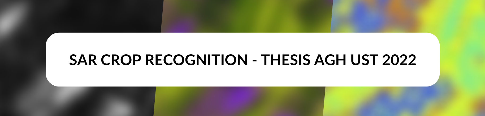

<h1 align="center"> SUPERVISED CROPLAND CLASSIFICATION BASED ON SENTINEL-1 SAR IMAGES IN POLAND </h1>

<table>
  <tr>
      <td>
    <td> Engineering Thesis written by Filip Giermek, geoinformatics at Geology, Geophysics and Enviromental Protection Faculty at University of Science and Technology in Cracow. </td>
  </tr>
</table> 

## Scope of the project
This paper focuses on conveying supervised random forest algorithm-based crop types recognition analysis in
chosen region of Poland, with usage of free software and open-access data. The goal of this paper is to recreate
general methodology of such projects and test usage of SAR imagery as a base. Area of interest is one of municipal
regions in eastern Poland.

## Ready-Data
tutaj cos o tym papierze na ktorym sie opieram
link do gita i papieru
## Objects
tutaj w punktach workflow

- Additional browser support

- Add more integrations

## Workflow


## Product


## Code Snipets
tutaj dac fragmenty kodu i co robią
na przyklad
```js
var wheat_points = ee.FeatureCollection.randomPoints(
    {region: wheat_vec, points: NOP, seed: 0, maxError: 1})
    .map(function(f) {
        return f.set('landcover', 2)
    });
````

## Conclusions
This research provides an example of geospatial data analysis on basis of satellite imagery fully based on
open-access of open-source data and software (besides creating map layouts in ArcGIS Pro. They can be made in
QGIS as well). It is an effect of a valid number of tests and different approaches, techniques, methods and data.
Every iteration of this research revealed how rich with information satellite imagery and derivative technologies
are, including GIS approach part. If improved in future along these steps:
- Introduction of optical imagery at the stage of pre-processing
- Suitable sample data from area similar to target region
- Less vector manipulations (requires more computing power)
this project will deliver even more interesting conclusions and valuable information.

## Authors

Filip Giermek AGH UST Cracow 2022
