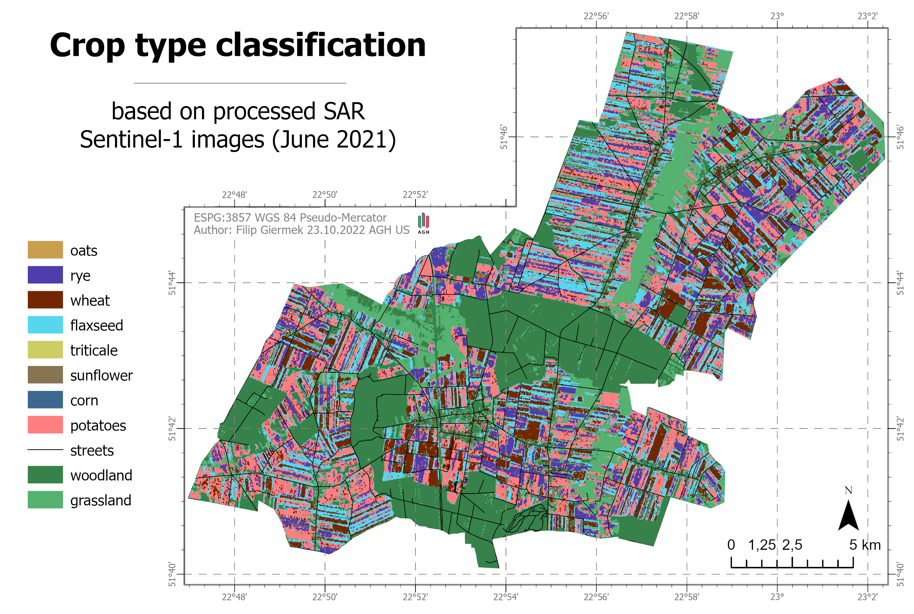

<h1 align="center"> SUPERVISED CROPLAND CLASSIFICATION BASED ON SENTINEL-1 SAR IMAGES IN POLAND </h1>


tu musze napisac co to jest


## Ready-Data
tutaj cos o tym papierze na ktorym sie opieram
link do gita i papieru
## Objects
tutaj w punktach workflow

- Additional browser support

- Add more integrations

## Workflow


## Product




## Code Snipets
tutaj dac fragmenty kodu i co robią
na przyklad
```js
var wheat_points = ee.FeatureCollection.randomPoints(
    {region: wheat_vec, points: NOP, seed: 0, maxError: 1})
    .map(function(f) {
        return f.set('landcover', 2)
    });
````

## Conclusions
lista
## Authors

Filip Giermek AGH UST Cracow 2022
